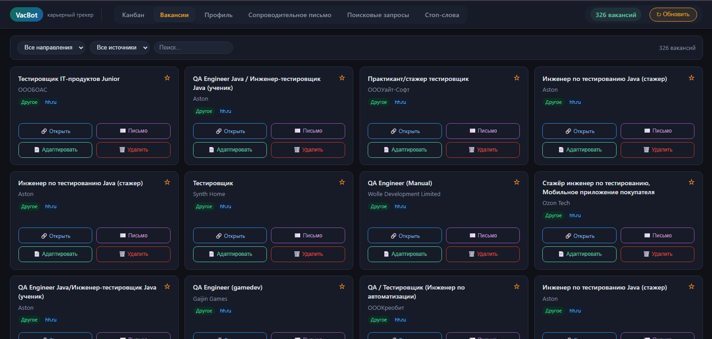
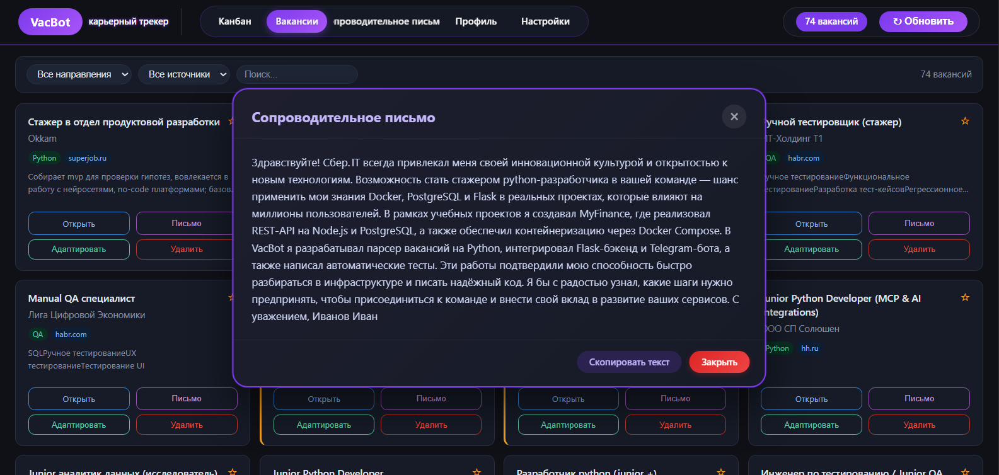
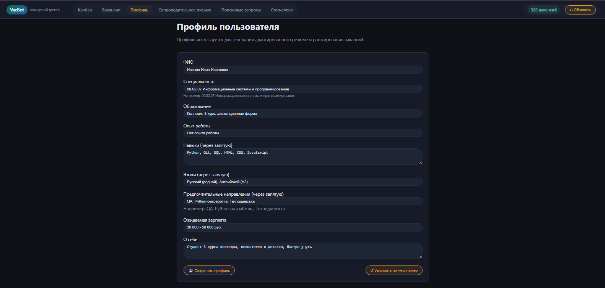
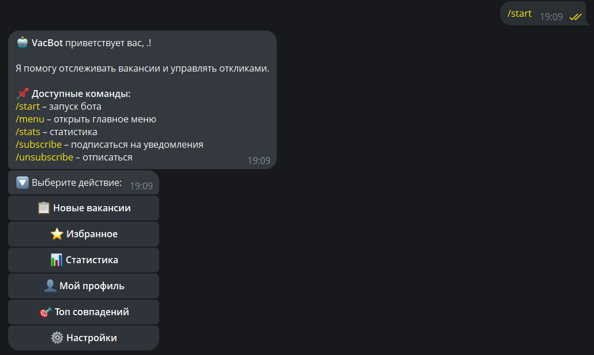

# 🤖 VacBot — AI-платформа для поиска и управления вакансиями

[](https://www.python.org/)
[](https://flask.palletsprojects.com/)
[](https://www.postgresql.org/)
[](https://core.telegram.org/bots)
[](https://mit-license.org/)

> **VacBot** — многофункциональная AI-платформа для поиска работы, сбора вакансий из нескольких источников, управления откликами через канбан-доску и Telegram-бота.

---

## 📸 Скриншоты

### Канбан-доска


*Drag & Drop, проценты совпадения, 6 статусов отклика*

### Список вакансий


*Фильтрация по направлениям, источникам, поиск*

### AI-генерация письма


*Адаптация резюме и генерация сопроводительных писем через Claude AI*

### Профиль пользователя


*Редактируемый профиль для точного совпадения с вакансиями*

### Telegram-бот


*Просмотр вакансий, управление статусами, статистика*

# ✨ Возможности
## 🎯 Парсинг вакансий

- Сбор вакансий из:
  - hh.ru
  - SuperJob API
  - Trudvsem API
  

- Поддержка нескольких поисковых запросов
- Фильтрация по стоп-словам
- Автоматическое определение направления:
  - QA
  - Python
  - 1С
  - Аналитика
  - Техподдержка
  - и другие

---

## 📋 Управление откликами

### Канбан-доска

- Drag & Drop интерфейс
- 6 статусов вакансий:
  - Новые
  - Избранное
  - Отклик
  - Собеседование
  - Отказ
  - Оффер
- Процент совпадения с профилем
- Фильтрация вакансий
- Система избранного

---

## 🤖 AI-ассистент

Поддержка OpenRouter / Claude / GPT-4o.

### Возможности AI:

- Адаптация резюме под вакансию
- Генерация сопроводительного письма
- Анализ требований работодателя
- Фильтрация вакансий по стоп-словам

---

## 📱 Telegram-бот

- Просмотр вакансий
- Управление статусами
- Удаление вакансий
- Подписка на уведомления
- Статистика в реальном времени

---

## 🎨 Интерфейс

- Тёмная тема
- Адаптивный дизайн
- Анимации и toast-уведомления
- Модальные окна

---

## 📊 Профиль пользователя

- Редактируемый профиль
- Навыки и опыт
- Шаблон сопроводительного письма
- Процент совпадения с вакансиями

---

# 🏗️ Технологии

| Компонент | Технологии |
|---|---|
| Backend | Python 3.12, Flask, SQLAlchemy |
| Database | PostgreSQL |
| Frontend | HTML5, CSS3, JavaScript |
| Parsing | Requests, BeautifulSoup4 |
| AI | OpenRouter API |
| Telegram | python-telegram-bot |
| Scheduler | APScheduler |
| Containerization | Docker, Docker Compose |

---

# 🚀 Быстрый старт

## Предварительные требования

- Python 3.12+
- PostgreSQL 15+
- Telegram Bot Token
- OpenRouter API Key

---

## 1. Клонирование репозитория

```bash
git clone https://github.com/yourusername/vacbot.git
cd vacbot
```

---

## 2. Создание виртуального окружения

### Linux / macOS

```bash
python -m venv venv
source venv/bin/activate
```

### Windows (CMD)

```bash
python -m venv venv
venv\Scripts\activate
```

### Windows (PowerShell)
```
python -m venv venv
venv\Scripts\Activate.ps1
```
---

## 3. Установка зависимостей

```bash
pip install -r requirements.txt
```

---

## 4. Настройка переменных окружения

```bash
cp .env.example .env
```

После этого заполните `.env` своими API-ключами.

---

## 5. Настройка PostgreSQL

```sql
CREATE DATABASE vacbot;
CREATE USER vacbot WITH PASSWORD 'vacbot';
GRANT ALL PRIVILEGES ON DATABASE vacbot TO vacbot;
```

---

## 6. Запуск приложения

### Вариант A — всё вместе

```bash
python run.py
```

### Вариант B — раздельный запуск

#### Flask

```bash
python run.py
```

#### Telegram-бот

```bash
python telegram_bot.py
```

#### Парсер вакансий

```bash
python main.py
```

---

# 🐳 Docker

## Запуск через Docker Compose

```bash
docker-compose up -d
```

После запуска приложение будет доступно по адресу:

```text
http://localhost:5000
```

---

# 🎮 Использование

## Веб-интерфейс

| Страница | Описание |
|---|---|
| `/` | Канбан-доска |
| `/vacancies` | Список вакансий |
| `/profile` | Профиль пользователя |
| `/cover-letter` | Шаблон письма |
| `/search-queries` | Управление поиском |
| `/stopwords` | Управление стоп-словами |

---

## Telegram-бот

| Команда | Описание |
|---|---|
| `/start` | Регистрация |
| `/menu` | Главное меню |
| `/stats` | Статистика |
| `/subscribe` | Подписка |
| `/unsubscribe` | Отписка |

---

# 🔌 API Endpoints

| Метод | Endpoint | Описание |
|---|---|---|
| POST | `/api/run-parser` | Запуск парсинга |
| GET | `/api/stats` | Статистика |
| POST | `/api/card/<id>/status` | Изменить статус |
| POST | `/api/card/<id>/star` | Добавить в избранное |
| POST | `/api/adapt-resume/<id>` | Адаптация резюме |
| POST | `/api/generate-cover-letter/<id>` | Генерация письма |
| DELETE | `/api/card/<id>/delete` | Удаление вакансии |

---

# 🧪 Тестирование

## Установка тестовых зависимостей

```bash
pip install pytest pytest-cov
```

## Запуск тестов

```bash
pytest tests/ -v --cov=app
```

## Проверка парсера

```bash
python src/fetcher.py
```

---

# 🗂️ Структура проекта

```text
└───vacbot
    │   .env
    │   .env.example
    │   .gitignore
    │   Dockerfile
    │   LICENSE
    │   main.py
    │   README.md
    │   render.yaml
    │   requirements.txt
    │   run.py
    │   start_bot.py
    │   telegram_bot.py
    │
    ├───app
    │   │   ai_agent.py
    │   │   config.py
    │   │   models.py
    │   │   parser_service.py
    │   │   routes.py
    │   │   scheduler.py
    │   │   __init__.py
    │   │
    │   ├───static
    │   │   ├───css
    │   │   │       style.css
    │   │   │
    │   │   └───js
    │   │           app.js
    │   │
    │   └───templates
    │           base.html
    │           cover_letter.html
    │           index.html
    │           profile.html
    │           search_queries.html
    │           stopwords.html
    │           vacancies.html
    │
    ├───data
    │       .gitkeep
    │
    └───src
            analyzer.py
            fetcher.py
```

---

# 🛣️ Roadmap

## 🔥 Ближайшие задачи

- Добавить pytest-тесты
- Улучшить AI-модальные окна
- Добавить графики аналитики
- Экспорт статистики в CSV/PDF
- Поле заметок в карточке вакансии

---

## 🤖 AI-агент нового поколения

- Автоматическая адаптация резюме
- Генерация уникальных сопроводительных писем
- Мониторинг ответов работодателей
- Классификация HR-ответов
- Защита от автоответчиков

---

## 📱 Telegram-бот

- Инлайн-режим
- Ежедневная рассылка вакансий
- Гибкие подписки
- Поиск вакансий по ключевым словам

---

## 🎨 UI/UX

- Светлая тема
- Улучшенная мобильная адаптация
- Анимации Drag & Drop

---

## 🐳 DevOps

- CI/CD через GitHub Actions
- Бесплатный деплой
- Автоматические бэкапы

---

## 📊 Аналитика

- Прогноз успешности отклика
- Анализ популярных навыков
- Тренды зарплат

---

# 🤝 Как внести вклад

1. Сделайте Fork репозитория
2. Создайте feature-ветку

```bash
git checkout -b feature/amazing-feature
```

3. Сделайте commit

```bash
git commit -m "Add amazing feature"
```

4. Отправьте изменения

```bash
git push origin feature/amazing-feature
```

5. Создайте Pull Request

---

# 📞 Контакты

- Telegram-бот: [@VacScanner_bot](https://t.me/VacScanner_bot)
- Issues: [GitHub Issues](https://github.com/yourusername/vacbot/issues)

---

# 📄 Лицензия

Проект распространяется по лицензии MIT.

Подробности смотрите в файле `LICENSE`.

---

# 🌟 Благодарности

- Anthropic
- OpenRouter
- hh.ru
- SuperJob
- Trudvsem

---

# ⭐ Поддержка проекта

Если проект оказался полезным — поставьте ⭐ репозиторию.

