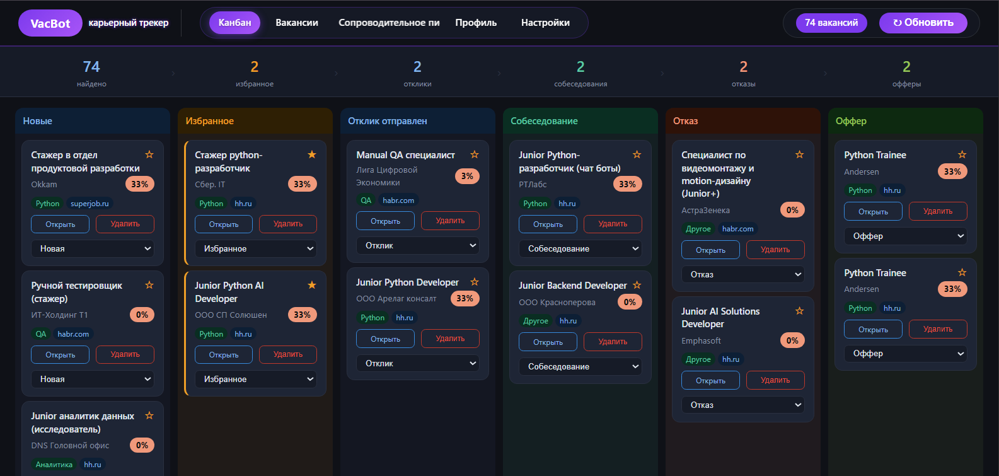
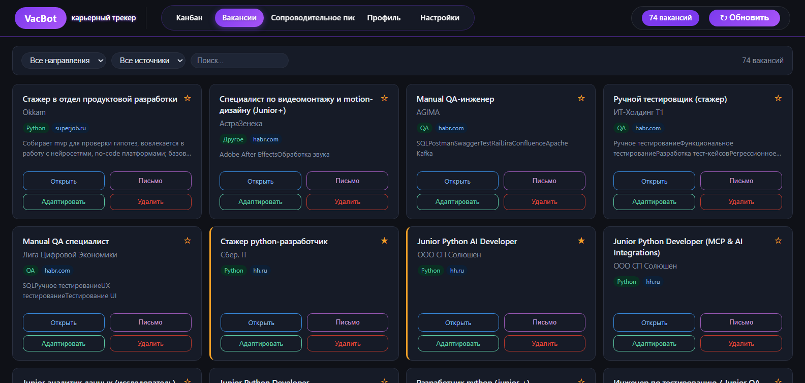
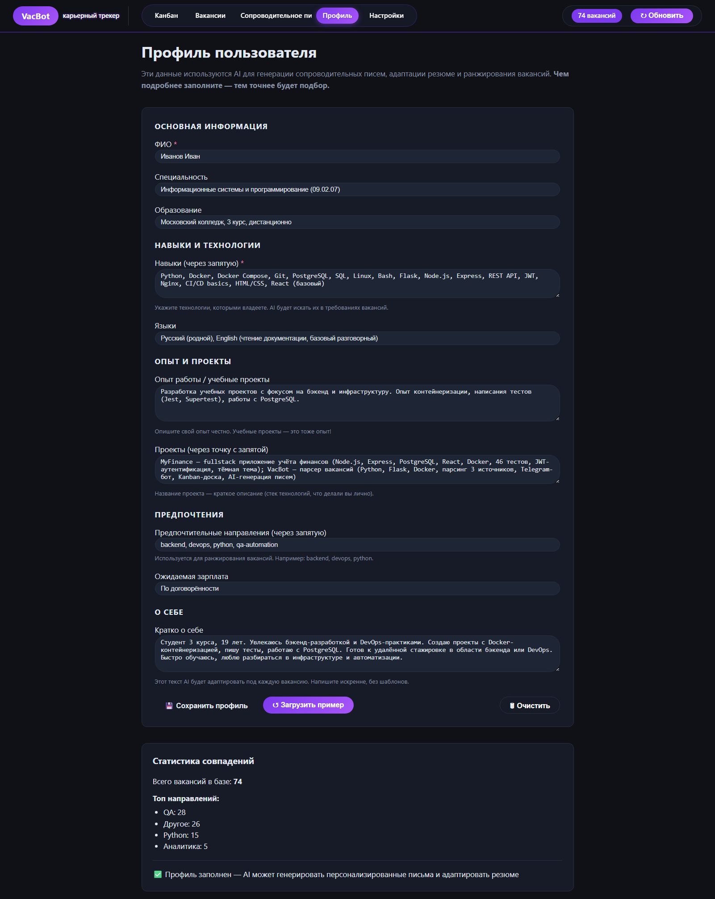
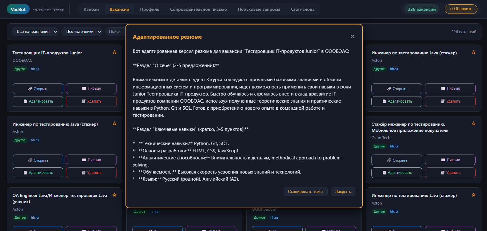

# 📖 Руководство пользователя VacBot

## Оглавление
1. [Введение](#введение)
2. [Установка и запуск](#установка-и-запуск)
3. [Веб-интерфейс](#веб-интерфейс)
   - Канбан-доска
   - Список вакансий
   - Профиль пользователя
4. [Telegram-бот](#telegram-бот)
5. [AI-функции](#ai-функции)
6. [Часто задаваемые вопросы](#часто-задаваемые-вопросы)

---

## Введение

VacBot — это платформа для поиска работы, которая:
- 🔍 Автоматически собирает вакансии с hh.ru, SuperJob, Trudvsem
- 📊 Анализирует требования и показывает процент совпадения
- 🤖 Помогает адаптировать резюме и писать сопроводительные письма через AI
- 📱 Позволяет управлять откликами через Telegram

---

## Веб-интерфейс

### Канбан-доска (главная страница)

**Возможности:**
- 🖱️ **Drag & Drop** — перетаскивайте карточки между колонками
- ⭐ **Избранное** — отмечайте важные вакансии звездочкой
- 📊 **Процент совпадения** — показывает, насколько вакансия подходит вам
- 🔄 **Смена статуса** — через выпадающий список в каждой карточке

**Статусы вакансий:**
| Статус | Значение |
|--------|----------|
| Новые | Только что найденные вакансии |
| Избранное | Отмеченные как важные |
| Отклик | Отклик отправлен |
| Собеседование | Назначена встреча |
| Отказ | Получен отказ |
| Оффер | Получено предложение |

---

### Список вакансий

**Фильтры:**
- По направлению (QA, Python, 1С и др.)
- По источнику (hh.ru, SuperJob, Trudvsem)
- Поиск по названию и компании

**Действия:**
- 🔗 Открыть — перейти на страницу вакансии
- ✉️ Письмо — сгенерировать сопроводительное письмо (AI)
- 📄 Адаптировать — адаптировать резюме под вакансию (AI)
- 🗑️ Удалить — удалить вакансию из базы

---

### Профиль пользователя

**Заполните профиль для точного совпадения:**
- Имя, специальность, образование
- Навыки (через запятую)
- Опыт работы
- Предпочтительные направления
- Ожидаемая зарплата

> 💡 **Совет:** Чем детальнее профиль, тем точнее AI адаптирует резюме!

---

### Поисковые запросы

Управляйте ключевыми словами для парсинга вакансий.  
Каждая строка — отдельный запрос. Парсер собирает вакансии по всем запросам.

---

### Стоп-слова

Слова и фразы, при наличии которых вакансия НЕ будет сохранена.  
Пример: "высшее образование", "водительские права".

---

## Telegram-бот

**Username:** [@VacScanner_bot](https://t.me/VacScanner_bot)

### Команды

| Команда | Что делает |
|---------|------------|
| `/start` | Главное меню |
| `/menu` | Показать меню |
| `/stats` | Статистика по вакансиям |
| `/subscribe` | Подписаться на уведомления |
| `/unsubscribe` | Отписаться |

### Возможности бота

- 📋 **Просмотр вакансий** — новые, избранные, топ по совпадению
- 🔄 **Смена статуса** — управляйте откликами из Telegram
- ⭐ **Избранное** — отмечайте важные вакансии
- 🗑️ **Удаление** — удаляйте неподходящие вакансии

---

## AI-функции

### Адаптация резюме

При нажатии на кнопку **"Адаптировать резюме"** AI:
1. Анализирует требования вакансии
2. Сравнивает с вашим профилем
3. Генерирует персонализированный текст "О себе"

### Генерация сопроводительного письма

При нажатии на кнопку **"Письмо (AI)"** создаётся уникальное письмо под конкретную вакансию.

> ⚠️ **Важно:** Для работы AI требуется API-ключ OpenRouter (указан в `.env`)

---

## Часто задаваемые вопросы

### ❓ Почему вакансия не перемещается в "Избранное"?
Убедитесь, что вы выбрали статус "Избранное" в выпадающем списке. Звездочка только отмечает вакансию, но не перемещает.

### ❓ Бот не отвечает?
1. Проверьте, что VPN включён (Например, если Вы из России)
2. Убедитесь, что бот запущен: `python telegram_bot.py`
3. Проверьте токен в `.env`

### ❓ Как обновить вакансии?
Нажмите кнопку **"↻ Обновить"** в правом верхнем углу или запустите `python main.py`

### ❓ Где хранятся данные?
- Вакансии и карточки — в PostgreSQL
- Настройки — в `.env`
- Временные файлы — в `data/`

---

## Поддержка

- **Telegram:** [@VacScanner_bot](https://t.me/VacScanner_bot)
- **GitHub Issues:** [Создать обращение](https://github.com/zalina-devops/vacbot/issues)

---

© 2025 VacBot. MIT License